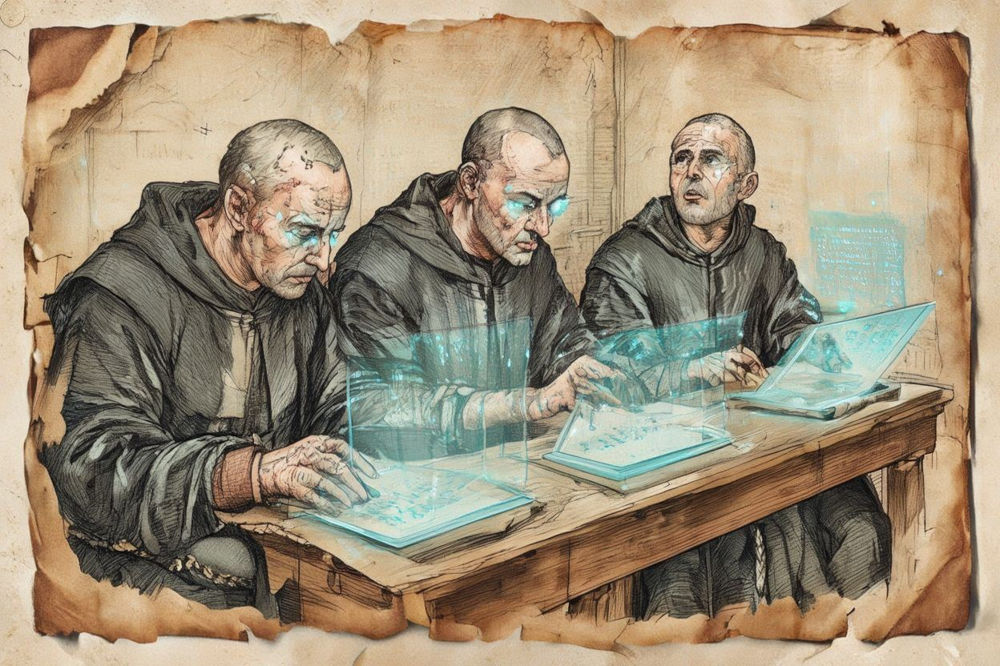

<p align="center">
  
</p>

# 🏛️ Cloister

A distroless Docker image for development environments featuring Python, Node.js, TypeScript, Claude Code CLI, git, and vfox version manager.

## ✨ Features

- 🔒 **Distroless** - Chainguard Wolfi base
- 🐚 **Zsh & Fish** - Modern shells with vfox integration
- 🪟 **Zellij** - Terminal multiplexer
- 🐍 **Python 3** with pip
- 💚 **Node.js** with npm
- 🔷 **TypeScript** with ts-node for direct execution
- 🤖 **Claude Code CLI** - Anthropic's official CLI for Claude
- 📦 **git** with git-lfs - Version control
- 🦥 **lazygit** - Terminal UI for git
- 🦊 **vfox** - Universal version manager

## 🚀 Quick Start

### Run 

Runs cloister with your existing authentication and current directory mounted as the workspace.
```bash
podman run --userns=keep-id -it --rm -h task001 \
  -v ~/.claude:/home/monk/.claude \
  -v ~/.claude.json:/home/monk/.claude.json \
  -v ~/.cache/claude-cli-nodejs/:/home/monk/.cache/claude-cli-nodejs/ \
  -v $(pwd):/workspace \
  -w /workspace \
  ghcr.io/jogai/cloister:latest
```

| Flag | Purpose |
|------|---------|
| `--userns=keep-id` | Maps your host UID to the container user, preserving file ownership |
| `-it` | Interactive mode with terminal |
| `--rm` | Automatically remove the container when it exits |
| `-h task001` | Sets the container hostname (useful for identifying sessions) |
| `-v ~/.claude:...` | Mounts Claude config directory for persistent settings |
| `-v ~/.claude.json:...` | Mounts Claude authentication file |
| `-v ~/.cache/claude-cli-nodejs/:...` | Mounts Claude CLI cache for faster startup and persistent state |
| `-v $(pwd):/workspace/my-claude-project` | Mounts current directory as (the subfolder is to make resuming sessions easier) `/workspace/my-claude-project` |
| `-w /workspace` | Sets the working directory inside the container |

### Pull the image

```bash
docker pull ghcr.io/jogai/cloister:latest
```

### Use Claude Code CLI

```bash
docker run -it --rm \
  -e ANTHROPIC_API_KEY=your-api-key \
  -v $(pwd):/workspace \
  -w /workspace \
  ghcr.io/jogai/cloister:latest \
  claude "Help me with this code"
```

### Run a specific command

```bash
# Run Python script
docker run -it --rm -v $(pwd):/workspace ghcr.io/jogai/cloister:latest python3 script.py

# Run TypeScript
docker run -it --rm -v $(pwd):/workspace ghcr.io/jogai/cloister:latest ts-node app.ts
```

## 🔨 Building Locally

```bash
# Build the image
docker build -t cloister .

# Build for specific architecture
docker buildx build --platform linux/amd64 -t cloister .
```

## 🛠️ Tool Versions

| Tool | Version |
|------|---------|
| Wolfi | latest |
| Zsh | Wolfi package |
| Fish | Wolfi package |
| Zellij | Latest |
| Node.js | Wolfi package |
| Python | Wolfi package |
| TypeScript | Latest npm |
| Claude Code CLI | Latest |
| lazygit | Wolfi package |
| vfox | Latest |

## ⚙️ Environment Variables

| Variable | Description | Default |
|----------|-------------|---------|
| `ANTHROPIC_API_KEY` | API key for Claude Code CLI | - |
| `NODE_ENV` | Node.js environment | production |
| `PYTHONUNBUFFERED` | Unbuffered Python output | 1 |
| `LANG` | System locale | C.UTF-8 |
| `VFOX_HOME` | vfox configuration directory | /home/monk/.version-fox |
| `SHELL` | Default shell | /bin/zsh |

## 🔒 Security

- Runs as non-root user (UID 1000)
- Distroless Wolfi base
- Minimal attack surface with only runtime dependencies
- Regular security scanning via Trivy
- SBOM and provenance attestations included
- Multi-architecture support (amd64, arm64)

## 🔄 GitHub Actions Workflow

The image is automatically built and pushed to GHCR on:

- Push to `main` or `master` branches
- Git tags matching `v*.*.*`
- Manual workflow dispatch

### Workflow Features

- Multi-architecture builds (amd64, arm64)
- Layer caching for faster builds
- Automatic security scanning with Trivy
- SBOM generation
- Build provenance attestation
- Comprehensive tool testing

### Manual Trigger Options

When triggering the workflow manually, you can specify:

- **image_tag**: Custom tag for the image
- **platforms**: Target `linux/amd64`, `linux/arm64`, or both

## 🐙 Container Registry

Images are published to GitHub Container Registry (ghcr.io):

```bash
ghcr.io/jogai/cloister:latest
ghcr.io/jogai/cloister:v1.0.0

# SHA-based tags
ghcr.io/jogai/cloister:sha-abc1234
```

## 📄 License

MIT License
